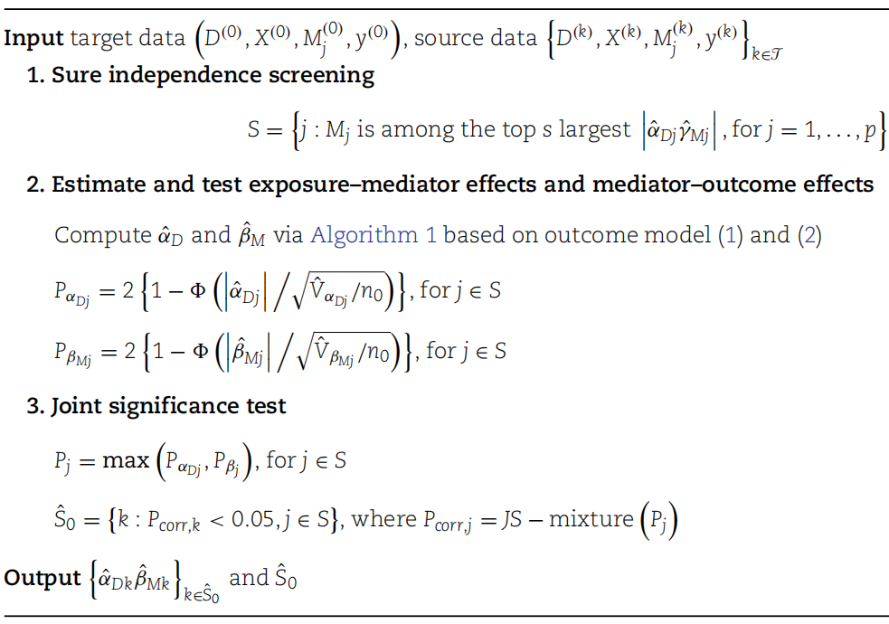
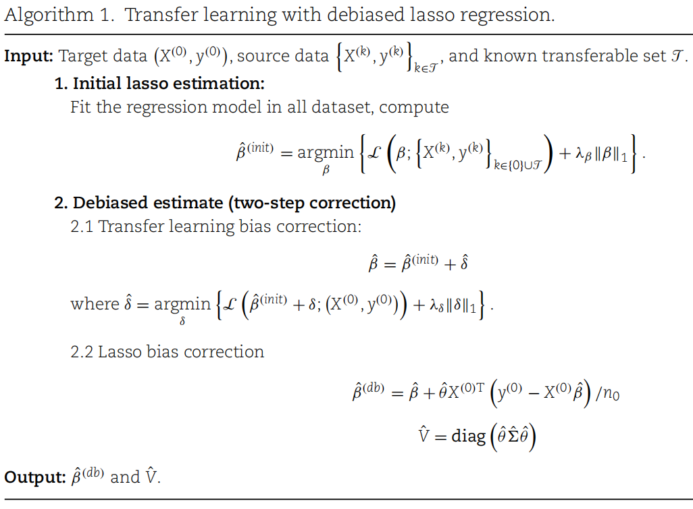

```{r, include = FALSE}
knitr::opts_chunk$set(
  collapse = TRUE,
  comment = "#>"
)
```

## Overview of TransHDM

This work addresses the problem of **high-dimensional mediation analysis under limited sample sizes**. To overcome the challenges of high dimensionality and low statistical power, we adopt a **transfer learning framework** that leverages external source data to improve mediation inference in the target population.

The proposed method, **TransHDM**, follows a three-stage procedure. It first applies Sure Independence Screening (SIS) to reduce the dimensionality of candidate mediators. It then estimates exposure–mediator and mediator–outcome effects and combines them to obtain indirect (mediation) effects. Finally, overall mediation effects, including indirect, direct, and total effects, are summarized for inference.

Specifically, **SIS** ranks mediators based on marginal associations and retains a manageable subset, improving computational efficiency and screening accuracy. Exposure–mediator and mediator–outcome effects are then estimated using high-dimensional regression techniques, optionally incorporating transferable source data. These estimates are combined through the product-of-coefficients approach to quantify mediator-specific indirect effects and overall mediation effects.

Through this staged design and the integration of transferable information, TransHDM is able to more accurately identify true mediators and reduce false discoveries, particularly in small-sample, high-dimensional settings.

{width=60%}

The methodology implemented in TransHDM is based on the framework proposed in
Pan L, Liu Y, Huang C, Lin R, Yu Y, Qin G. Transfer learning reveals the mediating mechanisms of cross-ethnic lipid metabolic pathways in the association between APOE gene and Alzheimer's disease. Brief Bioinform. 2025;26(5):bbaf460. <doi:10.1093/bib/bbaf460>

## Basic Workflow

```{r setup}
library(TransHDM)
```

### Simulation Data Generation Design

We generate synthetic data for high-dimensional mediation analysis under different settings.

The target data follow a homogeneous data-generating process, where treatment, mediators, and outcome depend on covariates. Additional source datasets with larger sample sizes are generated under both transferable and non-transferable settings, as well as with covariate shift (homogeneous and heterogeneous settings).

This setup is used to illustrate how the method behaves under different data scenarios.

```{r data}
seed <- 1
set.seed(seed)

# ---------------- Simulation Parameters ---------------- #
p_m <- 50     # num of mediators
n <- 100      # num of target samples
rho <- 0.1    # rho for simulation data generation
p_x <- 5      # num of covariates
n_s <- 300    # num of source samples

# ---------------- Target Data Generation ---------------- #
target_sim <- gen_simData_homo(n = n, p_x = p_x, p_m = p_m, rho = rho)
target_data <- target_sim$data

# true effect of target data
true_effect <- target_sim$coef$beta2 * target_sim$coef$alpha1

# column names
M_col <- paste0("M", 1:p_m)
X_col <- paste0("X", 1:p_x)

# ---------------- Source Data Generation ---------------- #
# source, transferable, homogeneous
s_data <- gen_simData_homo(n = n_s, p_x = p_x, p_m = p_m, rho = rho,
                          source = TRUE, transferable = TRUE, h = 2, seed=seed)$data

# source, not transferable, homogeneous
s_f_data <- gen_simData_homo(n = n_s, p_x = p_x, p_m = p_m, rho = rho,
                            source = TRUE, transferable = FALSE, h = 2, seed=seed)$data

# source, transferable, heterogeneous
s_h_data <- gen_simData_hetero(n = n_s, p_x = p_x, p_m = p_m, rho = rho,
                              source = TRUE, transferable = TRUE, h = 2, seed=seed)$data

# source, not transferable, heterogeneous
s_hf_data <- gen_simData_hetero(n = n_s, p_x = p_x, p_m = p_m, rho = rho,
                               source = TRUE, transferable = FALSE, h = 2, seed=seed)$data
```

Display the true mediator effects used in the simulation and briefly inspect the structure of the target dataset.

```{r show_data}
# ---------------- Show Data ---------------- #
# show true mediator effect
true_effect

# # show target data
# head(target_data)
```

### Source Data Detection

We first apply the source detection procedure to identify which external datasets are transferable to the target data.

The function source_detection() compares prediction performance across candidate source datasets using cross-validation, with the target-only model as a baseline.

In this example, four source datasets are considered under different data settings. The summary output reports the validation losses and indicates which sources are selected as transferable.

```{r detection}
detect_all <- source_detection(
  target_data = target_data,
  source_data = list(s_data, s_f_data,s_h_data, s_hf_data),
  Y = "Y",
  D = "D",
  M = M_col,
  X = X_col,
  kfold = 5,
  C0 = 0.01,
  verbose = TRUE
)
summary(detect_all)
```

### High-Dimensional Mediation Analysis with TransHDM

We illustrate the use of `TransHDM` for conducting high-dimensional mediation analysis under a transfer learning framework.

We first apply TransHDM to the target data only as a baseline analysis.

```{r TransHDM_notrans}
set.seed(seed)

# mediation analysis without transfer learning
res_n <- TransHDM(
  target_data = target_data,
  source_data = NULL,
  Y = "Y",
  D = "D",
  M = M_col,
  X = X_col,
  transfer = FALSE,
  topN = NULL,
  dblasso_SIS = FALSE,
  verbose = TRUE,
  ncore = 1
)
summary(res_n)
```

We then incorporate external source data to enable transfer learning, considering both homogeneous and heterogeneous source settings.

The outputs summarize the selected mediators and their estimated indirect effects, allowing comparison between analyses with and without transfer learning.

```{r TransHDM_transfer}
# mediation analysis with transfer learning (using homogeneous data)
res_t <- TransHDM(
  target_data = target_data,
  source_data = s_data,
  Y = "Y",
  D = "D",
  M = M_col,
  X = X_col,
  transfer = TRUE,
  topN = NULL,
  dblasso_SIS = FALSE,
  verbose = TRUE,
  ncore = 1
)
summary(res_t)
```

```{r TransHDM_hetero, eval = FALSE}
# mediation analysis with transfer learning (using heterogeneous data)
res_h <- TransHDM(
  target_data = target_data,
  source_data = s_h_data,
  Y = "Y",
  D = "D",
  M = M_col,
  X = X_col,
  transfer = TRUE,
  topN = NULL,
  dblasso_SIS = FALSE,
  verbose = TRUE,
  ncore = 1
)
summary(res_h)
```
With limited target sample size, some spurious mediators may be selected. Incorporating transferable source data leads to more stable estimates and fewer false discoveries.

### Parallel Computation

The `TransHDM` function supports parallel computation through the `ncore` argument, which allows mediator models to be fitted using multiple CPU cores. 

```{r TransHDM_paral, eval = FALSE}
res_p <- TransHDM(
  target_data = target_data,
  source_data = s_data,
  Y = "Y",
  D = "D",
  M = M_col,
  X = X_col,
  transfer = TRUE,
  topN = NULL,
  dblasso_SIS = FALSE,
  verbose = TRUE,
  ncore = 4
)
summary(res_h)
```

## Utility functions

### Sure Independence Screening (SIS)

We use Sure Independence Screening (SIS) as the first step to reduce the number of candidate mediators in high-dimensional settings. Mediators are ranked by their marginal associations with the exposure and the outcome, and only the top mediators are retained. SIS can be applied with or without transfer learning.

```{r SIS, eval = FALSE}
# SIS without transfer learning
SIS_n <- SIS(
  target_data = target_data,
  source_data = NULL,
  Y = "Y",
  D = "D",
  M = M_col,
  X = X_col,
  topN = 10,
  transfer = FALSE,
  verbose = TRUE,
  ncore = 1,
  dblasso_method = FALSE
)
summary(SIS_n)

# SIS with transfer learning
SIS_t <- SIS(
  target_data = target_data,
  source_data = s_data,
  Y = "Y",
  D = "D",
  M = M_col,
  X = X_col,
  topN = 10,
  transfer = TRUE,
  verbose = TRUE,
  ncore = 1,
  dblasso_method = FALSE
)
summary(SIS_t)
```

### Linear Regression Models for Transfer Learning

This section demonstrates two transfer learning methods for linear regression implemented in the package: standard lasso transfer learning and double/debiased lasso transfer learning.

```{r data_reg}
library(MASS)
n_target <- 1000
n_source <- 2000
p <- 20

Sigma <- 0.2^abs(outer(1:p, 1:p, "-"))  # Autocorrelation structure, weak correlation
X_target <- mvrnorm(n_target, mu = rep(0, p), Sigma = Sigma)
X_source <- mvrnorm(n_source, mu = rep(0, p), Sigma = Sigma)

# Construct signal coefficients
# First 3 variables are strong signals, next 2 are weak signals, rest are zero
beta <- c(1.5, -1, 1.0, 0.5, -0.5, rep(0, p-5))

# Construct response variables with noise
y_target <- X_target %*% beta + rnorm(n_target, sd = 1)
y_source <- X_source %*% beta + rnorm(n_source, sd = 1)

# Build target/source lists
target <- list(x = X_target, y = y_target)
source <- list(x = X_source, y = y_source)
```

#### Lasso for transfer learning

Primary used in source_detection() and SIS() functions. Applies lasso regression with optional transfer learning.

```{r lasso}
# Fit lasso without transfer learning
coef_n_l <- lasso(target = target, transfer = FALSE, lambda = 'lambda.1se')
summary(coef_n_l)

# Fit lasso with transfer learning
coef_t_l <- lasso(target = target, source = source, transfer = TRUE, lambda = 'lambda.1se')
summary(coef_t_l)
```

#### Debiased Lasso for transfer learning

Primary used in estimation of `TransHDM()` function. This two-stage debiasing procedure addresses regularization bias:
1. First debiasing step: Transfer learning bias correction using source data.
2. Second debiasing step: Lasso bias correction within target data.

{width=60%}


The method produces debiased coefficient estimates with valid confidence intervals, making it suitable for high-dimensional inference.

```{r dblasso}
# Fit dblasso without transfer learning
coef_n_d <- dblasso(target = target, transfer = FALSE, lambda = 'lambda.1se')
summary(coef_n_d)

# Fit dblasso with transfer learning
coef_t_d <- dblasso(target = target, source = source, transfer = TRUE, lambda = 'lambda.1se')
summary(coef_t_d)
```
